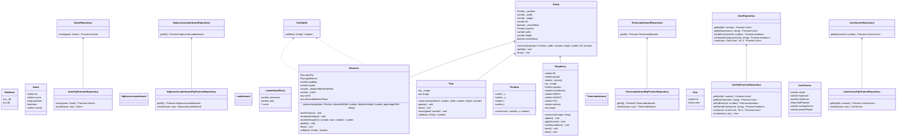

# RaspberryRocketeer

## Class Diagram of all classes

```mermaid
classDiagram
direction BT
class Collidable {
   collides(o: Entity) boolean
}
class Database {
   any _db
   any db
}
class Entity {
   constructor(position: Position, width: number, height: number, fill: number) 
   Position _position
   number _width
   number _height
   number fill
   boolean _showHitbox
   update() void
   draw() void
   Position position
   number width
   number height
   boolean showHitbox
}
class Game {
   number id
   number score
   string playtime
   Date date
   number userId
}
class GamePgPromiseRepository {
   insert(game: Game) Promise~Game~
   serialize(raw: any) Game
}
class GameRepository {
   insert(game: Game) Promise~Game~
}
class HighscoreLeaderboard
class HighscoreLeaderboardPgPromiseRepository {
   getAll() Promise~HighscoreLeaderboard~
   serialize(raw: any) HighscoreLeaderboard
}
class HighscoreLeaderboardRepository {
   getAll() Promise~HighscoreLeaderboard~
}
class Leaderboard
class LeaderboardEntry {
   number username
   number rank
   T score
}
class Obstacle {
   constructor(position: Position, obstacleWidth: number, obstacleHeight: number, pipeImagePath: string) 
   Pipe pipeTop
   Pipe pipeBottom
   number padding
   number speed
   number _distanceBetweenPipes
   number _startX
   resetPosition() void
   randomizeHeight() void
   randomRange(min: number, max: number) number
   update() void
   draw() void
   collides(o: Entity) boolean
   any startX
   any distanceBetweenPipes
}
class Pipe {
   constructor(positionX: number, width: number, height: number) 
   any _image
   update() void
   draw() void
   move(speed: number) void
   collides(o: Entity) boolean
   any image
}
class Position {
   constructor(x: number, y: number) 
   number _x
   number _y
   number x
   number y
}
class Raspberry {
   constructor(image: string) 
   number lift
   number gravity
   number _velocity
   any _image
   Position position
   number maxVelocity
   number WIDTH
   number HEIGHT
   number FILL
   update() void
   applyGravity() void
   forceBoundaries() void
   boost() void
   draw() void
   number velocity
   any image
}
class TimeLeaderboard
class TimeLeaderboardPgPromiseRepository {
   getAll() Promise~TimeLeaderboard~
   serialize(raw: any) TimeLeaderboard
}
class TimeLeaderboardRepository {
   getAll() Promise~TimeLeaderboard~
}
class User {
   number id
   string name
}
class UserPgPromiseRepository {
   getById(id: number) Promise~User~
   getByName(name: string) Promise~User~
   withIdExists(id: number) Promise~boolean~
   withNameExists(name: string) Promise~boolean~
   insert(user: Omit~User, "id"~) Promise~User~
   serialize(raw: any) User
}
class UserRepository {
   getById(id: number) Promise~User~
   getByName(name: string) Promise~User~
   withIdExists(userId: number) Promise~boolean~
   withNameExists(username: string) Promise~boolean~
   insert(user: Omit~User, "id"~) Promise~User~
}
class UserScores {
   number userId
   number highscore
   number totalScore
   string totalPlaytime
   number averageScore
   number gamesPlayed
}
class UserScoresPgPromiseRepository {
   getById(id: number) Promise~UserScores~
   serialize(raw: any) UserScores
}
class UserScoresRepository {
   getById(userId: number) Promise~UserScores~
}

GamePgPromiseRepository  -->  GameRepository 
HighscoreLeaderboardPgPromiseRepository  -->  HighscoreLeaderboardRepository 
Obstacle  ..>  Collidable 
Obstacle  -->  Entity 
Pipe  ..>  Collidable 
Pipe  -->  Entity 
Raspberry  -->  Entity 
TimeLeaderboardPgPromiseRepository  -->  TimeLeaderboardRepository 
UserPgPromiseRepository  -->  UserRepository 
UserScoresPgPromiseRepository  -->  UserScoresRepository 

```
