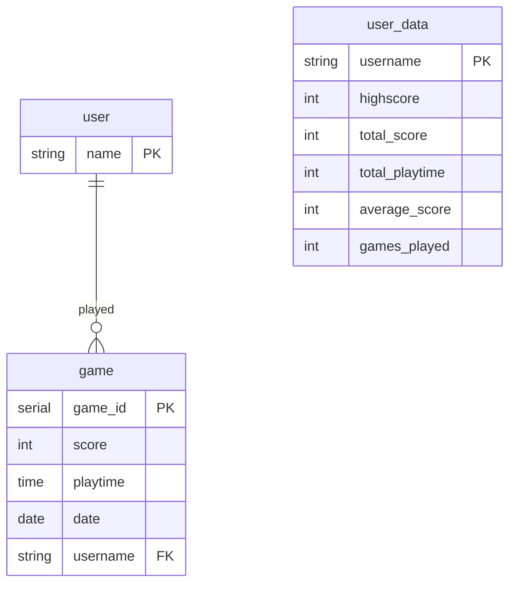

## Database Schema

```mermaid
erDiagram
    user {
        string name PK
    }

    game {
        serial game_id PK
        int score
        time playtime
        date date
        string username FK
    }

    user ||--O{ game : "played"

    user_data {
        string username PK
        int highscore
        int total_score
        int total_playtime
        int average_score
        int games_played
    }
```