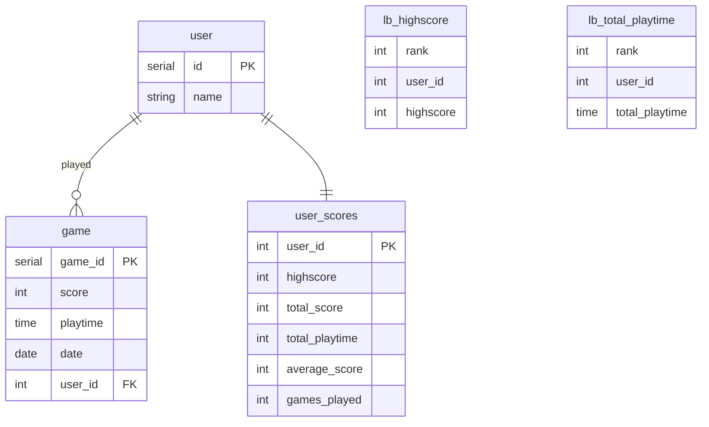

## Database Schema

`lb_highscore` and `lb_total_playtime` are views querying the `user_scores` table.

A trigger function on insert to the `user` table creates a new row in `user_scores`. Everytime a new `game` is inserted, the row is updated.