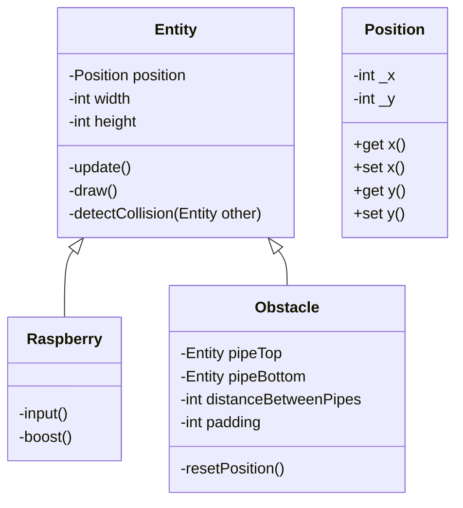

```mermaid
classDiagram
Entity <|-- Raspberry
Entity <|-- Obstacle
Entity: -Position position
Entity: -int width
Entity: -int height
Entity: -update()
Entity: -draw()
Entity: -detectCollision(Entity other)
class Raspberry{
-input()
-boost()
}

class Obstacle{
-Entity pipeTop
-Entity pipeBottom
-int distanceBetweenPipes
-int padding
-resetPosition()
}

class Position{
-int _x
-int _y

+get x()
+set x()
+get y()
+set y()
}
```