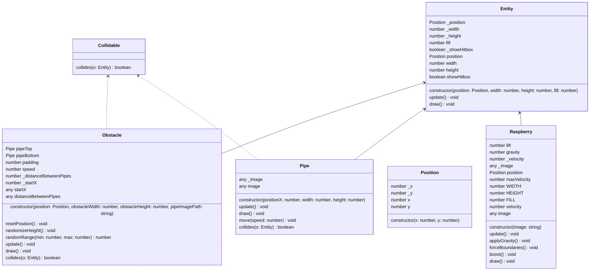

```mermaid
classDiagram
direction BT
class Collidable {
   collides(o: Entity) boolean
}
class Entity {
   constructor(position: Position, width: number, height: number, fill: number) 
   Position _position
   number _width
   number _height
   number fill
   boolean _showHitbox
   update() void
   draw() void
   Position position
   number width
   number height
   boolean showHitbox
}
class Obstacle {
   constructor(position: Position, obstacleWidth: number, obstacleHeight: number, pipeImagePath: string) 
   Pipe pipeTop
   Pipe pipeBottom
   number padding
   number speed
   number _distanceBetweenPipes
   number _startX
   resetPosition() void
   randomizeHeight() void
   randomRange(min: number, max: number) number
   update() void
   draw() void
   collides(o: Entity) boolean
   any startX
   any distanceBetweenPipes
}
class Pipe {
   constructor(positionX: number, width: number, height: number) 
   any _image
   update() void
   draw() void
   move(speed: number) void
   collides(o: Entity) boolean
   any image
}
class Position {
   constructor(x: number, y: number) 
   number _x
   number _y
   number x
   number y
}
class Raspberry {
   constructor(image: string) 
   number lift
   number gravity
   number _velocity
   any _image
   Position position
   number maxVelocity
   number WIDTH
   number HEIGHT
   number FILL
   update() void
   applyGravity() void
   forceBoundaries() void
   boost() void
   draw() void
   number velocity
   any image
}

Obstacle  ..>  Collidable 
Obstacle  -->  Entity 
Pipe  ..>  Collidable 
Pipe  -->  Entity 
Raspberry  -->  Entity 

```
