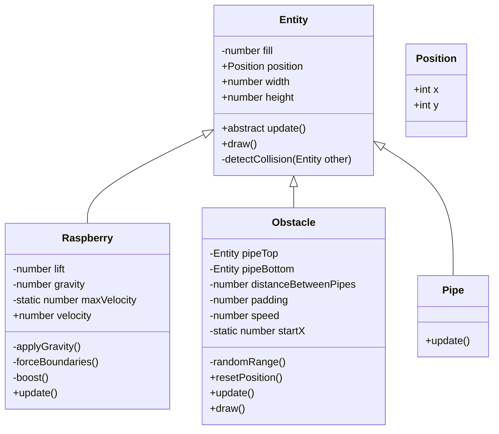

```mermaid
classDiagram
Entity <|-- Raspberry
Entity <|-- Obstacle
Entity <|-- Pipe
Entity: -number fill
Entity: +Position position
Entity: +number width
Entity: +number height
Entity: +abstract update()
Entity: +draw()
Entity: -detectCollision(Entity other)

class Raspberry{
-number lift
-number gravity
-static number maxVelocity
+number velocity

-applyGravity()
-forceBoundaries()
-boost()
+update()
}

class Obstacle{
-Entity pipeTop
-Entity pipeBottom
-number distanceBetweenPipes
-number padding
-number speed
-static number startX

-randomRange()
+resetPosition()
+update()
+draw()
}

class Pipe {
+update()
}

class Position{
+int x
+int y
}
```